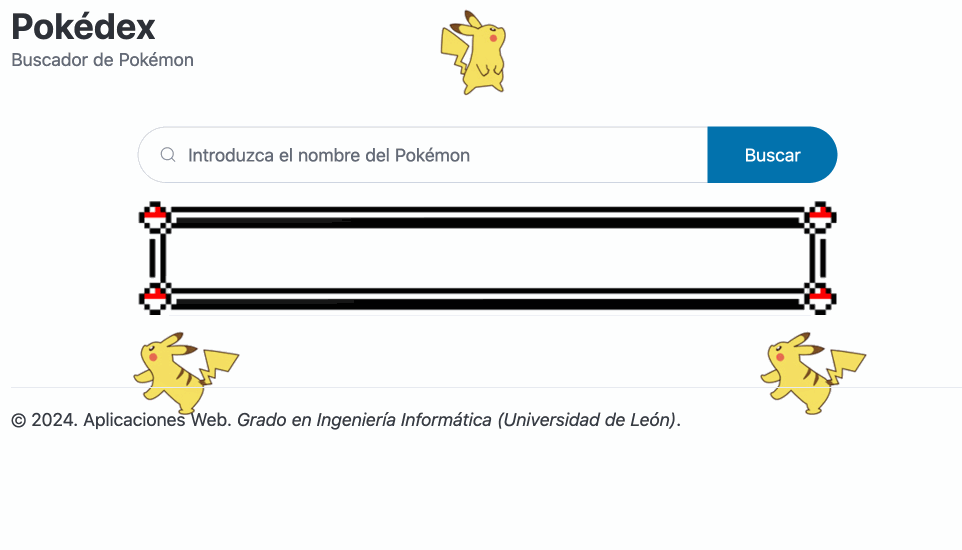

[](https://classroom.github.com/a/vt9T-ONv)
# Aplicaciones Web (Grado en Ingeniería Informática. Universidad de León)

## Laboratorio 05 (semana 08/04/2024 -- 14/04/2024)

## Objetivos

1. Profundizar en el uso de JavaScript
2. Familiarizarse con el uso de módulos JavaScript
3. Trabajar con la API Document para generar contenido HTML de forma dinámica

## Requisitos

* [GitHub Codespaces](https://docs.github.com/en/codespaces/overview)
* [Visual Studio Code](https://code.visualstudio.com/)

## Referencias

* [JavaScript Reference@DevDocs](https://devdocs.io/javascript/)
* [JavaScript reference@MDN Web Docs](https://developer.mozilla.org/en-US/docs/Web/JavaScript/Reference)
* [Document API@MDN Web Docs](https://developer.mozilla.org/en-US/docs/Web/API/Document)

### Fuentes utilizadas

* [Pico.css](https://picocss.com/)
* [Pokemon.json](https://github.com/Purukitto/pokemon-data.json)
* [Pokemon Types CSS](https://github.com/justingolden21/pokemon-types-css)
* [Imágenes Pokémon-Original Stitch](https://drive.google.com/drive/u/4/folders/1Yc-LotcNPmNsVGcOISu4yUhhMeCw8-Hh)

## Enunciado

Un [buscador](https://es.wikipedia.org/wiki/Motor_de_búsqueda) es un sistema informático diseñado para que un usuario pueda encontrar información sobre algún tema específico (la cual generalmente estará almacenada en algún sistema de base de datos). Para ello, el usuario realiza una consulta a través de un conjunto de criterios y el buscador responde mostrando los resultados de forma ordenada (generalmente utilizando listas o tablas).

Implementar la funcionalidad de un buscador utilizando únicamente JavaScript. Concretamente, el buscador mostrará al usuario información sobre diferentes [Pokémons](https://es.wikipedia.org/wiki/Pokémon). El resultado final deberá ser el siguiente:



### Estructura

Inicialmente, el proyecto ya contiene todos los elementos necesarios del frontend para construir la estructura del buscador y está organizado de la siguiente manera:

```
.
├── assets/
│   ├── css/
│   │   ├── pico.min.css            # Framework Pico.CSS
│   │   └── types.min.css           # Framework Pokemon Types CSS
│   ├── img/                        # Directorio para almacenar imágenes
│   │   └── *.[jpg|png]
│   └── js/
│       ├── db/
│       │   └── data.js             # Base de datos en formato JSON
│       ├── modules/
│       │   ├── database.mjs        # Módulo JS para trabajar sobre una base de datos
│       │   └── html-components.mjs # Módulo JS para crear componentes HTML
│       └── main.js                 # Script para gestionar eventos en el frontend
└── index.html                      # Página de inicio
```

Importante:

* El fichero `index.html` contiene el frontend del buscador y **no está permitido su modificación**.
* Se utilizan dos frameworks CSS diferentes: [Pico.css](https://picocss.com/) y [Pokemon Types CSS](https://github.com/justingolden21/pokemon-types-css).
* La base de datos `data.js` es un fichero que contiene información almacenada en formato JSON, la cual ha sido extraída del repositorio [Pokemon.json](https://github.com/Purukitto/pokemon-data.json). **No está permitido modificar este fichero**.
* La funcionalidad a implementar **está repartida en los diferentes ficheros JavaScript** (`main.js`, `database.mjs` y `html-components.mjs`).

### Funcionamiento

Este proyecto hace uso de [módulos JavaScript](https://developer.mozilla.org/en-US/docs/Web/JavaScript/Guide/Modules) por lo que para trabajar con él es **obligatorio** que esté siendo ejecutado desde un servidor web (**no vale abrir directamente el fichero `index.html` desde un navegador**).

Para ello, se utilizará un servidor web local mediante la extensión [Live Preview](https://marketplace.visualstudio.com/items?itemName=ms-vscode.live-server) de Visual Studio Code (la cuál ya está instalada dentro del *GitHub Codespace*). Para lanzar el servidor basta con pulsar la tecla `F1` y seleccionar el comando `Live Preview: Start Server Logging`. Esto arrancará un servidor web local utilizando el puerto `3000`.

## Ejercicio 1: Cargar módulos JavaScript

Un [módulo JavaScript](https://developer.mozilla.org/en/docs/Web/JavaScript/Guide/Modules) permite ofrecer bajo demanda las características definidas en un script (variables, funciones, clases, etc) a otros ficheros JavaScript. Actualmente, los navegadores modernos soportan el uso de módulos JavaScript de forma nativa y cabe notar que:

* Los módulos JavaScript pueden tener extensión `.mjs` ó `.js`.
* Para cargar un módulo JavaScript desde un documento HTML es necesario indicar el atributo `type="module"` desde un elemento `script` (ver `index.html`).
* Para poder ofrecer las características de un módulo es necesario **exportarlas** previamente utilizando la declaración [export](https://developer.mozilla.org/en-US/docs/Web/JavaScript/Reference/Statements/export).
* Para poder acceder a las características de otro módulo es necesario **importarlas** mediante la declaración [import](https://developer.mozilla.org/en-US/docs/Web/JavaScript/Reference/Statements/import).

Sabiendo esto, se pide realizar las siguientes modificaciones:

1. Modificar `database.mjs` para importar el fichero `assets/js/db/data.js` como un módulo utilizando el alias `db`. A continuación exporta la función `searchPokemonByName`.
2. Modificar `html-components.mjs` para exportar las funciones `updatePageStyle`, `updatePokedexArticle` y `updatePokemonTypeTableColumn`.
3. Modificar `main.js` para poder importar los módulos `database.mjs` con el alias `db` y el módulo `html-components.mjs` con el alias `html`.
4. Modificar `database.mjs`y `html-components.mjs` para mostrar por consola un mensaje que indique que el módulo ha sido cargado con éxito.

## Ejercicio 2: Implementar el módulo de base de datos

Para este laboratorio, la base de datos está almacenada en formato JSON en el fichero `assets/js/db/data.js`. Este fichero contiene un `Array` de `Object`s, donde cada elemento representa los diferentes datos de un Pokémon.

Implementar la función `searchPokemonByName` del módulo `database` para poder realizar búsquedas sobre la base de datos.

## Ejercicio 3: Implementar el módulo de componentes HTML

La [API Document](https://developer.mozilla.org/en-US/docs/Web/API/Document) de JavaScript contiene características que representan una página web cargada en el navegador y sirve como punto de entrada al contenido de la página web a través del árbol [DOM (Document Object Model)](https://developer.mozilla.org/en-US/docs/Web/API/Document_object_model/Using_the_Document_Object_Model). Esta API ofrece un objeto global denominado `document` con una serie de propiedades y métodos que permiten modificar ese árbol DOM, agregando nuevos elementos HTML (nodos) y editando o eliminando elementos HTML ya existentes (nodos). Algunos ejemplos de métodos importantes dentro de esta API son: [createElement](https://developer.mozilla.org/en-US/docs/Web/API/Document/createElement), [getElementById](https://developer.mozilla.org/en-US/docs/Web/API/Document/getElementById), [querySelectorAll](https://developer.mozilla.org/en-US/docs/Web/API/Document/querySelectorAll), [appendChild](https://developer.mozilla.org/en-US/docs/Web/API/Document/appendChild), [removeChild](https://developer.mozilla.org/en-US/docs/Web/API/Document/removeChild), etc.

Utilizando la API `Document`, implementar todas las funciones del módulo `html-components` para poder modificar o generar diferentes elementos HTML. Para ello, deberás seguir las indicaciones que haya en el código y tener en cuenta los siguientes aspectos:

* La tabla de los resultados debe seguir el formato indicado en el componente [Table de Pico.css](https://picocss.com/docs/table). Además, cada fila de resultados deberá tener colores alternos.
    * Cada fila tendrá cuatro columnas: (1) `No.`; (2) `Pokémon`; (3) `Especie`; y (4) `Tipo`.
    * En el pie de la tabla, habrá una única fila con una única celda de tipo encabezado de fila, que ocupa las 4 columnas, y que mostrará el número total de Pokémons listados en la propia tabla.
* Con respecto al contenido de la propia tabla:
    * Las celdas de la columna `No.` mostrarán el identificador del Pokémon.
    * Las celdas de la columna `Pokémon`, mostrarán una imagen y el nombre en inglés del Pokémon. Con respecto a la imagen, esta corresponderá al valor que haya en la propiedad `sprite`. Además, dicha imagen será un hipervínculo a la URL indicada en el valor de la propiedad `hires` y que se abrirá en una nueva ventana del navegador.
    * Las celdas de la columna `Especie` mostrarán la especie del Pokémon.
    * Las celdas de la columna `Tipo` mostrarán el tipo de Pokémon.
* Con respecto a las celdas de la columna `Tipo`:
    * La función `createPokemonTypeTableData` debe contener tantos elementos `span` como tipos tenga un Pokémon cuyo contenido sea el propio tipo. Sin embargo, en esta función no es posible asignar ningún atributo a dichos elementos.
    * La función `updatePokemonTypeTableColumn` debe encargarse de obtener todos los elementos `span` que haya en la tabla para actualizar su estilo y aplicar el definido en el framework [Pokemon Types CSS](https://github.com/justingolden21/pokemon-types-css)
* Con respecto al estilo de la página:
    * El cuerpo del documento debe tener el siguiente estilo:
        * Una imagen de fondo que corresponda a la del fichero `assets/img/bg.jpg`, con un tamaño que `cubra el contenido` y cuya posición esté `fija`
    * El apartado de los resultados debe tener el siguiente esitlo:
        * Un borde de tipo `sólido`, con un grosor de `39 píxeles` y que utilice la imagen del fichero `assets/img/bg.jpg` la cual debe tener un anchura de `39` y repetirse con el valor `stretch`.

## Ejercicio 4: Implementar los eventos

Como se vió en el laboratorio 04, la interacción del usuario con una página web produce [eventos](https://developer.mozilla.org/en-US/docs/Learn/JavaScript/Building_blocks/Events); los cuales pueden ser controlados mediante código JavaScript. Mediante la API `Document` también es posible asignar la gestión de eventos de forma dinámica utilizando el método [addEventListener](https://developer.mozilla.org/en-US/docs/Web/API/EventTarget/addEventListener) sobre los nodos del árbol DOM correspondientes.

Modificar el fichero `main.js` para implementar la función `searchPokedexHandler` y para asignar los correspondientes manejadores de eventos que se indique en el código.

## Entregable

La solución deberá estar subida en el repositorio correspondiente del GitHub Classroom **antes del domingo 14 de abril de 2024 a las 23:59 CEST**.