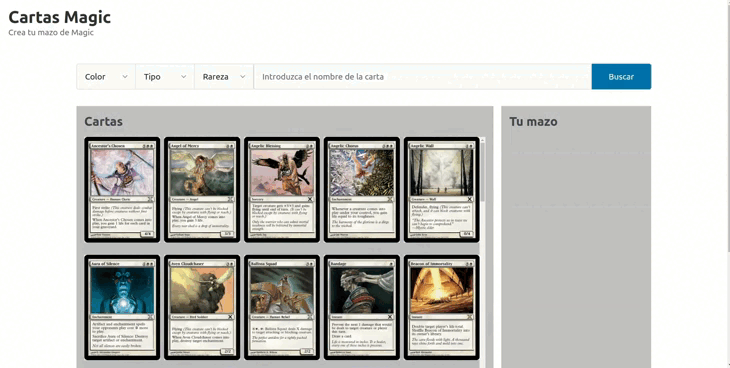

[](https://classroom.github.com/a/-x6PrsBm)
# Aplicaciones Web (Grado en Ingeniería Informática. Universidad de León)

## Laboratorio 06 (semana 15/04/2024 -- 21/04/2024)

## Objetivos

1. Profundizar en el uso de JavaScript
2. Trabajar con la API Fetch para obtener recursos
3. Profundizar en el uso de la API Document para mostrar y ocultar contenido HTML de forma dinámica

## Requisitos

- [GitHub Codespaces](https://docs.github.com/en/codespaces/overview)
- [Visual Studio Code](https://code.visualstudio.com/)

## Referencias

- [Sass Tutorial@W3Schools](https://www.w3schools.com/sass/default.php)
- [Sass: Documentation](https://sass-lang.com/documentation/)
- [JavaScript Reference@DevDocs](https://devdocs.io/javascript/)
- [JavaScript reference@MDN Web Docs](https://developer.mozilla.org/en-US/docs/Web/JavaScript/Reference)
- [Fetch API@MDN Web Docs](https://developer.mozilla.org/es/docs/Web/API/Fetch_API)
- [Document API@MDN Web Docs](https://developer.mozilla.org/en-US/docs/Web/API/Document)

### Fuentes utilizadas

- [Pico.css](https://picocss.com/)
- [Magic: The Gathering API](https://docs.magicthegathering.io/)
- [Tabler Icons](https://tabler.io/icons)

## Enunciado

Los filtros de búsqueda son herramientas que permiten restringir los resultados de acuerdo a criterios específicos, lo que facilita la búsqueda de contenido de manera eficiente y precisa. Al emplear filtros, los usuarios pueden afinar sus consultas para obtener resultados más relevantes y adecuados a sus necesidades, reduciendo así el tiempo y esfuerzo dedicados a revisar información no deseada.

Implementar una página web que consista en la creación de un mazo de cartas del juego [Magic: The Gathering](https://en.wikipedia.org/wiki/Magic:_The_Gathering_Arena). Un [mazo](https://magic.wizards.com/es/news/feature/building-your-first-deck-2006-10-28) consiste en una lista de cartas (como máximo 60) que pueden tener como máximo 4 copias de una misma carta, excepto aquellas que sean de tipo tierra básica.
La página deberá mostrar un catálogo de cartas que pueden ser filtradas por diferentes criterios (color, tipo y rareza), junto con un buscador por el nombre de carta para una búsqueda más específica.
Esta página permitirá ver detalles de las cartas y construir tu propio mazo.



### Estructura

Inicialmente, el proyecto ya contiene todos los elementos para construir la estructura de la página web y está organizado de la siguiente manera:

```
.
├── assets/
│   ├── css/
│   ├── img/                        # Directorio para almacenar imágenes
│   │   ├── *.[jpg|png]
│   ├── scss/
|   |   ├── pico/                   # Framework Pico.CSS
│   |   └── index.scss              # Fichero Sass
│   └── js/
│       ├── modules/
│       │   ├── database.mjs        # Módulo JS para trabajar sobre una base de datos
│       │   └── html-components.mjs # Módulo JS para crear componentes HTML
│       └── main.js                 # Script para gestionar eventos en el frontend
└── index.html                      # Página de inicio
```

Importante:

- El fichero `index.html` contiene el frontend y **no está permitido su modificación**.
- Se utilizan dos frameworks CSS diferentes: [Pico.css](https://picocss.com/) y [Tabler Icons](https://tabler.io/icons).
- El fichero `index.scss`, es un [fichero Sass](https://picocss.com/docs/sass) que contiene las reglas que permiten personalizar los estilos del framework Pico.css y **no está permitido su modificación**.
  Para traducir un fichero `.scss` a uno `.css`, hay que compilarlo utilizando el comando:

```console
$ sass <input.scss> <output.css>
```

- La funcionalidad a implementar **está repartida en los diferentes ficheros JavaScript** (`main.js`, `database.mjs` y `html-components.mjs`).

## Ejercicio 1: Cargar módulos JavaScript

- Para poder ofrecer las características de un módulo es necesario **exportarlas** previamente utilizando la declaración [export](https://developer.mozilla.org/en-US/docs/Web/JavaScript/Reference/Statements/export).
- Para poder acceder a las características de otro módulo es necesario **importarlas** mediante la declaración [import](https://developer.mozilla.org/en-US/docs/Web/JavaScript/Reference/Statements/import).

Sabiendo esto, se pide realizar las siguientes modificaciones:

1. Modificar `database.mjs` para exportar las funciones `fetchData`, `addCardToDeck`, `removeCardFromDeck`, `getCardDetails`, `applyFilter` y `searchCardByName` .
2. Modificar `html-components.mjs` para importar el módulo `database.mjs`con el alias `db` y exportar las funciones `createFilter` y `updateCardElements`.
3. Modificar `main.js` para poder importar los módulos `database.mjs` con el alias `db` y el módulo `html-components.mjs` con el alias `html`.
4. Modificar `database.mjs`y `html-components.mjs` para mostrar por consola un mensaje que indique que el módulo ha sido cargado con éxito.

## Ejercicio 2: Implementar el módulo de base de datos

La [API Fetch](https://developer.mozilla.org/es/docs/Web/API/Fetch_API) proporciona una interfaz JavaScript que permite realizar solicitudes HTTP asíncronas desde el navegador web. Se utiliza para obtener recursos de red, como archivos JSON, imágenes o datos de una API en línea.
En este laboratorio donde se pide mostrar un catálogo de cartas de Magic: The Gathering, la API Fetch se utiliza para obtener los datos de las cartas desde una API pública (`https://api.magicthegathering.io/v1/cards`). Esta solicitud a la API proporcionaría los detalles de las cartas, como su nombre, tipo, rareza y descripción. Una vez que se obtienen estos datos, se pueden utilizar para construir y actualizar la base de datos local de la aplicación, lo que permite mostrar las cartas en la interfaz de usuario. Para ello el resultado de la solicitud se debe convertir a formato `JSON` dando lugar a un `Array` de `Object`s, donde cada elemento representa las diferentes cartas.

Implementar las siguientes funciones del módulo `database`que van a permitir realizar las búsquedas sobre la base de datos, el filtrado y la gestión del mazo de cartas:

- `fetchData`: Permite obtener los datos de las cartas de Magic mediante la API pública (`https://api.magicthegathering.io/v1/cards`).
- `getCardDetails`: Obtiene los datos de una carta específica.
- `searchCardByName`: Busca una carta en la base de datos utilizando el nombre proporcionado en el formulario de búsqueda.
- `applyFilter`: Filtra el catálogo de cartas según las propiedades definidas por los filtros seleccionados.
- `addCardToDeck`: Agrega una carta al mazo. Se pueden tener hasta 60 cartas en el mazo, con un máximo de 4 copias de una carta, excepto para las cartas de tipo `Land`, las cuales no tienen restricciones de cantidad.
- `removeCardFromDeck`: Elimina una carta del mazo.

## Ejercicio 3: Implementar el módulo de componentes HTML

Utilizando la API `Document`, implementar todas las funciones del módulo `html-components` el cual se encarga de manipular y generar elementos HTML en la página web. Para ello, deberás seguir las indicaciones que haya en el código y tener en cuenta los siguientes aspectos:

- Para los filtros de `Tipo`, `Color` y `Rareza`, se deben crear las opciones correspondientes en los selectores desplegables por medio de la función `createFilter`. Cada opción debe contener los valores obtenidos de las propiedades de las cartas. Esto implica que los tipos, los colores y las rarezas representados en los filtros deben coincidir con todas las variantes encontradas en la base de datos de las cartas.
- La función `updateCardElements` va a permitir actualizar los elementos del frontend con las cartas correspondientes. Cada carta se representa como botón (`button`) y debe mostrar la imagen asociada a ella, siempre y cuando esté disponible. Cada botón debe tener la clase `card` y el [atributo de datos](https://developer.mozilla.org/en-US/docs/Learn/HTML/Howto/Use_data_attributes) `name` con el nombre de la carta.
- El mazo de cartas se visualiza, mediante la función `updateDeck`, como una lista de elementos `article`, cada uno con la clase `card-selected`. Estos elementos muestran la cantidad de copias de la carta en el mazo mediante un `span`, seguido del nombre de la carta. Además, se incluye un botón con el icono de `ti ti-trash`, el cual permite eliminar la carta del mazo al hacer clic sobre él.
- El elemento que mostrará los detalles de cada carta es un `article`, dentro del cual se incluirá un encabezado que contendrá el nombre de la carta. Además, se añadirán párrafos para mostrar el Coste de Maná, el Tipo y la Rareza de la carta, utilizando los valores específicos correspondientes a cada carta. Finalmente, se incluirá un párrafo para mostrar la descripción de la carta.

## Ejercicio 4: Implementar los eventos

Como se vió en el laboratorio 04 y 05, la interacción del usuario con una página web produce [eventos](https://developer.mozilla.org/en-US/docs/Learn/JavaScript/Building_blocks/Events); los cuales pueden ser controlados mediante código JavaScript. Mediante la API `Document` también es posible asignar la gestión de eventos de forma dinámica utilizando el método [addEventListener](https://developer.mozilla.org/en-US/docs/Web/API/EventTarget/addEventListener) sobre los nodos del árbol DOM correspondientes.

1. Modificar el fichero `main.js` para implementar las funciones `searchCardHandler` y `applyFilterHadler`. Además asignar un manejador de eventos que permita la realización de búsquedas en la base de datos al enviar los datos del mismo y el cambio de valor de los selectores para aplicar los filtros correspondientes a los datos.

2. Modificar el fichero `html-components.js` para implementar manejadores de eventos para cada carta. Estos manejadores permitirán añadir una carta al mazo al hacer clic sobre ella y mostrar los detalles (mediante la propiedad de estilo `display`) de la carta al pasar el ratón sobre ella. Además añadir manejadores de eventos para eliminar una carta del mazo al hacer clic en el botón correspondiente.

## Entregable

La solución deberá estar subida en el repositorio correspondiente del GitHub Classroom **antes del domingo 21 de abril de 2024 a las 23:59 CEST**.
