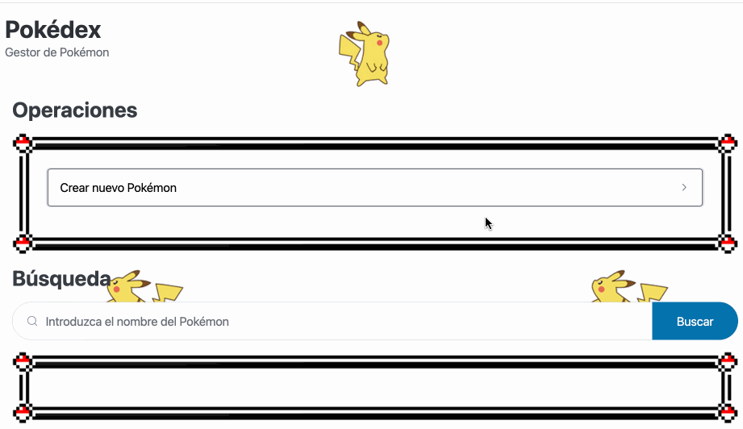
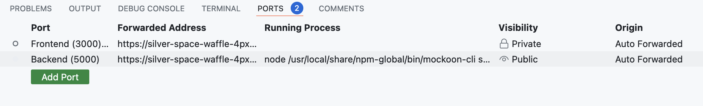

[](https://classroom.github.com/a/nZkekSS-)
[](https://classroom.github.com/open-in-codespaces?assignment_repo_id=14870832)
# Aplicaciones Web (Grado en Ingeniería Informática. Universidad de León)

## Laboratorio 07 (semana 22/04/2024 -- 05/05/2024)

## Objetivos

1. Trabajar con un servicio web de tipo API REST realizando operaciones CRUD
2. Profundizar en el uso de la API Fetch para obtener recursos

## Requisitos

* [GitHub Codespaces](https://docs.github.com/en/codespaces/overview)
* [Visual Studio Code](https://code.visualstudio.com/)

## Referencias

* [Mockoon GUI cheat sheet@Mockoon](https://mockoon.com/docs/latest/gui-cheat-sheet/)
* [JavaScript Reference@DevDocs](https://devdocs.io/javascript/)
* [JavaScript reference@MDN Web Docs](https://developer.mozilla.org/en-US/docs/Web/JavaScript/Reference)
* [Fetch API@MDN Web Docs](https://developer.mozilla.org/en-US/docs/Web/API/Fetch_API)
* [DOM API@MDN Web Docs](https://developer.mozilla.org/en-US/docs/Web/API/Document_Object_Model)

### Fuentes utilizadas

* [Mockoon](https://mockoon.com/)
* [Pokemon.json](https://github.com/Purukitto/pokemon-data.json)
* [Pokemon Types CSS](https://github.com/justingolden21/pokemon-types-css)
* [Imágenes Pokémon-Original Stitch](https://drive.google.com/drive/u/4/folders/1Yc-LotcNPmNsVGcOISu4yUhhMeCw8-Hh)

## Enunciado

Una [API REST](https://developer.mozilla.org/en-US/docs/Glossary/REST) es un tipo de servicio web basado en la premisa de que todo recurso tiene una URI asociada, y la comunicación entre cliente-servidor se realiza a través del protocolo HTTP a través de mensajes cuyo contenido está formateado utilizando XML ó JSON.

Implementar la funcionalidad de un frontend que permita trabajar con el mock de una API REST de [Pokémon](https://es.wikipedia.org/wiki/Pokémon). El resultado final deberá ser el siguiente:



### Estructura

Inicialmente, el proyecto ya contiene todos los elementos necesarios del frontend para construir el frontend y está organizado de la siguiente manera:

```
.
├── assets/
│   ├── css/
│   │   ├── pico.min.css            # Framework Pico.CSS
│   │   └── types.min.css           # Framework Pokemon Types CSS
│   ├── img/                        # Directorio para almacenar imágenes
│   │   └── *.[jpg|png]
│   └── js/
│       ├── modules/
│       │   ├── rest-api.mjs        # Módulo JS para realizar operaciones sobre una API REST
│       │   └── html-components.mjs # Módulo JS para crear componentes HTML
│       └── main.js                 # Script para gestionar eventos en el frontend
├── api_rest.json                   # Mock de una API REST sobre Pokémon
└── index.html                      # Página de inicio
```

Importante:

* El fichero `index.html` contiene el frontend y **no está permitido su modificación**.
* El fichero `api_rest.json` contiene el mock de una API REST y **no está permitido su modificación**.
* La funcionalidad a implementar **está repartida en los diferentes ficheros JavaScript** (`main.js`, `rest-api.mjs` y `html-components.mjs`).

### Funcionamiento

Este proyecto hace uso de [módulos JavaScript](https://developer.mozilla.org/en-US/docs/Web/JavaScript/Guide/Modules) por lo que para trabajar con él es **obligatorio** que esté siendo ejecutado desde un servidor web (**no vale abrir directamente el fichero `index.html` desde un navegador**).

Para ello, se utilizará un servidor web local mediante la extensión [Live Preview](https://marketplace.visualstudio.com/items?itemName=ms-vscode.live-server) de Visual Studio Code (la cuál ya está instalada dentro del *GitHub Codespace*). Para lanzar el servidor basta con pulsar la tecla `F1` y seleccionar el comando `Live Preview: Start Server Logging`. Esto arrancará un servidor web local utilizando el puerto `3000`.

## Ejercicio 1: Arrancar el mock de la API REST

Un [mock](https://en.wikipedia.org/wiki/Mock_object) es un objeto que simula el comportamiento de otro objeto real dentro de un entorno controlado. En relación con este concepto, [Mockoon](https://mockoon.com/) es una herramienta open-source que permite crear de forma sencilla mocks de APIs REST, con el objetivo de diseñarlas y ejecutarlas dentro de un entorno de desarrollo o de testing. Además, Mockoon está disponible tanto en versión [GUI](https://mockoon.com/download/) como en versión de [línea de comandos](https://mockoon.com/cli/). En el caso de utilizar GitHub Codespaces, la versión de línea de comandos ya viene instalada por defecto.

El fichero `rest_api.json` contiene un mock de una API REST sobre Pokémon creado con Mockoon y que implementa un backend con las siguientes características:

* Crea un servidor local en el puerto 5000.
* Define un contenedor de datos en formato JSON cuyo contenido es exactamente el mismo utilizado como base de datos en el Laboratorio 05 ([Pokemon.json](https://github.com/Purukitto/pokemon-data.json)). Mockoon utiliza este contenedor para simular la capa de persistencia de una aplicación web.
* Define un conjunto de URIs que componen las rutas (o endpoints) que dan soporte a una serie de [operaciones CRUD](https://developer.mozilla.org/en-US/docs/Glossary/CRUD) sobre el contenedor de datos mencionado anteriormente. Aunque la colección de endpoints es amplia (ver [documentación de Mockoon](https://mockoon.com/docs/latest/api-endpoints/crud-routes/#list-of-routes-and-operations), se puede resumir en la siguiente tabla:

| Método HTTP | Endpoint | Operación | Descripción | Request body | Response body |
|-------------|----------|-----------|-------------|--------------|---------------|
| POST | `/api/pokemon` | CREATE | Crea un nuevo Pokémon | Objeto JSON | Objeto JSON |
| GET | `/api/pokemon` | READ | Devuelve una lista de todos los Pokémon | - | Objeto JSON |
| GET | `/api/pokemon/:id` | READ | Devuelve un Pokémon específico | - | Objeto JSON |
| PUT | `/api/pokemon/:id` | UPDATE | Modifica un Pokémon existente | Objeto JSON | Objeto JSON |
| DELETE | `/api/pokemon/:id` | DELETE | Elimina un Pokémon específico | - | Objeto JSON |

Cabe destacar que la operación `GET /api/pokemon` soporta la inclusión de diferentes parámetros de consulta (ver [documentación de Mockoon](https://mockoon.com/docs/latest/api-endpoints/crud-routes/#filtering-sorting-and-pagination-on-the-main-get-route)), a destacar el parámetro  `search`, que permite realizar búsquedas sobre el contenedor de datos.

Teniendo en cuenta lo anterior, lanzar el mock de la API REST mediante la herramienta de línea de comandos ejecutando la siguiente línea desde el terminal:

```
mockoon-cli start --data ./api_rest.json
```

Esto creará un servidor web local accesible desde la URL http://localhost:5000/api/pokemon. En el caso de GitHub Codespaces, la URL corresponderá a la **generada de forma automática por el propio contenedor**. Si todo funciona correctamente, deberá aparecer la lista de Pokémon en formato JSON. También puedes probar el funcionamiento de la API REST utilizando alguna herramienta como [curl](https://curl.se/) o [postman](https://www.postman.com/)

**IMPORTATE (solo para GitHub Codespace, no aplica a desarrollos en local)**: Para evitar problemas relacionados con [CORS](https://developer.mozilla.org/en-US/docs/Web/HTTP/CORS), una vez arrancado el mock del servidor es necesario modificar la visibilidad del puerto 5000 de privado a **público**.



Por último, el módulo `assets/js/modules/rest-api.mjs` define un conjunto de funciones para realizar diferentes peticiones asíncronas desde el frontend utilizando la [API Fetch](https://developer.mozilla.org/en-US/docs/Web/API/Fetch_API). Modificar este fichero para definir una variable `baseURL` que contenga la URL base del servidor con el mock de la API REST.

## Ejercicio 2: Operación READ

Implementar en el frontend la funcionalidad necesaria para habilitar el buscador de Pokémon. Para ello:

1. Modificar el módulo `rest-api.mjs` para implementar la función `searchPokemonByName`. Utilizando la API Fetch, la función deberá hacer una petición `GET` al endpoint correspondiente.
2. Modificar el fichero `main.js` para implementar la función `searchPokedexHandler` según se indica en el código fuente y asociarle el manejador de evento correspondiente. Para mostrar alertas al usuario puedes utilizar el método [window.alert()](https://developer.mozilla.org/en-US/docs/Web/API/Window/alert).

## Ejercicio 3: Operación CREATE

Implementar en el frontend la funcionalidad necesaria para habilitar el formulario de crear un nuevo Pokémon. Para ello:

1. Modificar el módulo `rest-api.mjs` para implementar la función `createPokemon`. Utilizando la API Fetch, la función deberá hacer una petición `POST` al endpoint correspondiente. Para trabajar con los datos del formulario deberás hacer uso de la clase [FormData](https://developer.mozilla.org/en-US/docs/Web/API/FormData).
2. Modificar el fichero `main.js` para implementar la función `createPokemonHandler` según se indica en el código fuente y asociarle el manejador de evento correspondiente.

## Ejercicio 4: Operación DELETE

Implementar en el frontend la funcionalidad necesaria para habilitar el botón de eliminar un Pokémon dentro de la tabla de resultados. Para ello:

1. Modificar el módulo `rest-api.mjs` para implementar la función `deletePokemonById`. Utilizando la API Fetch, la función deberá hacer una petición `DELETE` al endpoint correspondiente.
2. Modificar el módulo `html-components.mjs` para implementar la función `updatePokemonActionTableColumn` según se indica en el código fuente.
3. Modificar el fichero `main.js` para implementar la función `deletePokemonHandler` según se indica en el código fuente. Para mostrar un diálogo de confirmación al usuario puedes utilizar el método [window.confirm()](https://developer.mozilla.org/en-US/docs/Web/API/Window/confirm). Finalmente, modificar también `searchPokedexHandler` para utilizar la función `updatePokemonActionTableColumn`. 

## Ejercicio 5: Operación UPDATE (opcional)

**IMPORTANTE**: Este ejercicio es **opcional** y como tal, no es necesario completarlo para la entrega del laboratorio.

Implementar en el frontend la funcionalidad necesaria para poder editar los datos de un Pokémon específico. Para ello:

1. Editar el fichero `index.html` para crear un nuevo formulario dentro de la sección de operaciones con la misma estructura que el de "Crear nuevo Pokémon" pero denominado "Editar Pokémon".
2. Modificar el módulo `rest-api.mjs` para implementar dos funciones nuevas `getPokemonById` y `updatePokemon` que, utilizando la API Fetch, realicen las peticiones adecuadas a los endpoints correspondientes.
3. Modificar el fichero `main.js` para implementar la función `selectPokemonHandler` (rellena el formulario de "Editar Pokémon" con los datos del correspondiente Pokémon seleccionado obtenidos desde la API REST) y `updatePokemonHandler` (envía los datos del formulario de "Editar Pokémon" a la API REST). Además, agregar el manejador correspondiente al botón de "Editar" el Pokémon.
4. Modificar el módulo `html-components.mjs` para implementar la función `updatePokemonTableColumn` para que actualice todos los hipervínculos de la tabla de resultados y agregue un manejador de tipo click que llame a la función `selectPokemonHandler`.

## Entregable

La solución deberá estar subida en el repositorio correspondiente del GitHub Classroom **antes del domingo 05 de mayo de 2024 a las 23:59 CEST**.